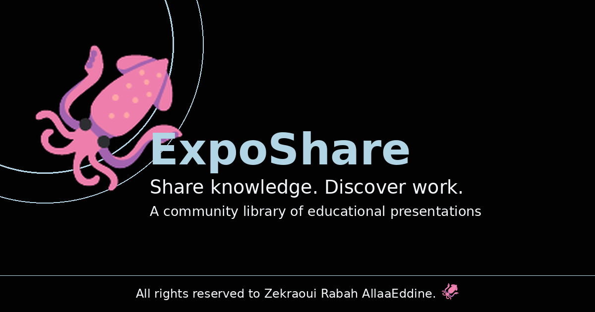

# ExpoShare 🦑



A community platform for uploading and discovering educational
presentations, built with vanilla HTML/CSS/JS.
---


## . File structure

```
/
├── index.html, browse.html, upload.html, presentation.html,
│   templates.html, login.html, signup.html, forgot-password.html,
│   update-password.html, profile.html, public-profile.html,
│   admin.html, about.html, contact.html
├── manifest.json
├── robots.txt
├── assets/
│   ├── style.css       (Onyx × Candy Blue design system)
│   ├── config.js
│   ├── i18n.js           (translation engine)
│   ├── lang-switch.js    (header language dropdown)
│   ├── app.js            (toasts, modals, loading screen, search, mascot)
│   ├── auth.js            
│   ├── browse.js
│   ├── upload.js
│   ├── admin.js
│   ├── profile.js
│   └── icons/             (favicons, apple-touch-icon, manifest icons, OG image)
├── data/
│   ├── taxonomy.json
│   ├── socials.json
│   └── i18n/{en,fr,ar}.json
└── supabase/
    └── migrations/000(1-7)_init.sql
    |___functions----send-emails
                  ---translate-bio


## License / Contact

Free to use. Questions or feedback: use the in-app contact form, or reach out on [LinkedIn](https://www.linkedin.com/in/zekraouirabahallaaeddine).

© 2026 Zekraoui Rabah Allaa Eddine🦑. 
All Rights Reserved.
Unauthorized copying, reproduction, modification, redistribution, or commercial use of this project or its source code is prohibited. For permission, licensing, or other inquiries, contact the copyright holder.
